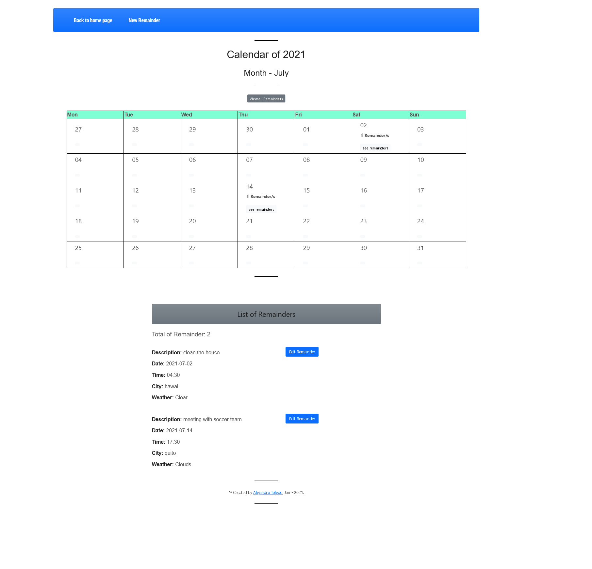
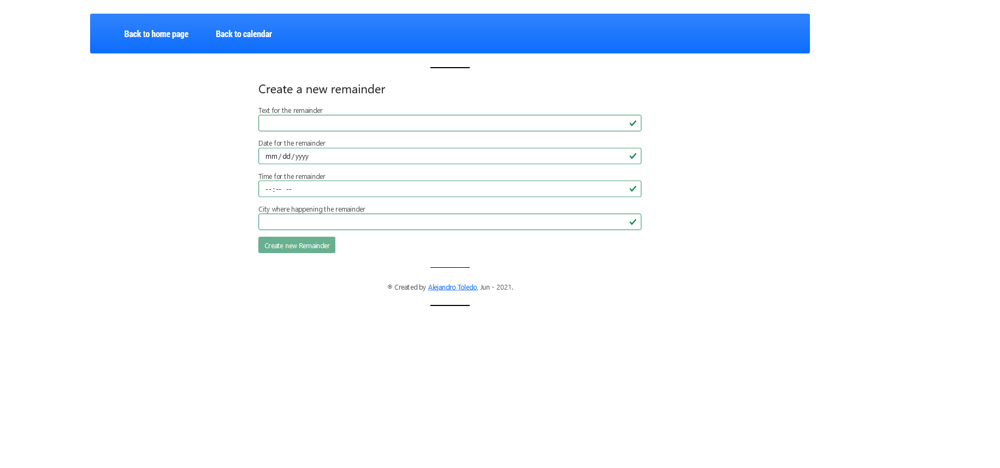
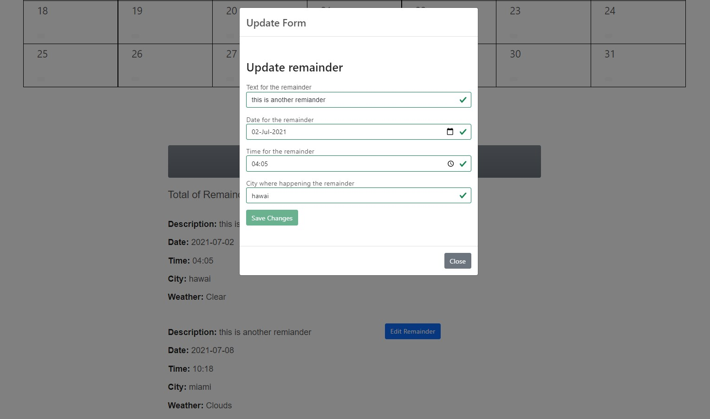

    

# React Challenge

## Frontend using React and Redux task for JOBISTY

This project is part of the process for a job application in Jobsity.

The features of the project are the following:

- One month calendar (July) where you can see the remainders that you create.
- The remainder created by the user can have the attributes of description, date, time, city and weather. The last attribute weather is taken from [OpenWeaterAPI](https://openweathermap.org/api) based on the city of the remainder. The dates for the remainders have to be between July.
- The user can filter the remainders for date click on each date inside the calendar or see all remainders available by clicking on `view all remainders` above the calendar.
- Also, the user can update any attribute from the listed remainders and also the weather will update based on the new city if updated.

## Calendar View with some remainderSchema

## View of the page to create a new remainderSchema

## Update form displayed as a Modal form to updated any remainder.

## Built With

- JavaScript
- React&Redux

### Main dependencies used

- Redux: to manage the entire state of the app
- Redux-thunk: to apply middleware for the app
- Axios: to make requests to the weather API
- Formik: to create the forms
- Yup: to validates the inputs in forms
- react-boostrap: to create the modals
- boostrap: to help with the styling of the app
- create-unique-id: to create a random unique id for each remainder

## Getting Started

To get a local copy up and follow these simple example steps.

### Prerequisites

- Local Machine installed [Nodejs](https://nodejs.org/en/download/)
- Yarn as a package manager
- A code editor as [Visual Studio](https://code.visualstudio.com/download), Sublime,etc.
- Create an account in [OpenWeaterAPI](https://openweathermap.org/api) where you will obtain an API KEY.
  With this API KEY, please create a `.env` file in the projects with this code inside `REACT_APP_WEATHER_API_KEY=` and after this paste the key obtained before.

### Setup

- Please make a local copy of this repo by typing this command on your terminal.

`git clone https://github.com/alejandrotoledoweb/React_Challenge.git`

- Then, go to the folder created with:

`cd React_Challenge`

## Available Scripts

In the project directory, you can run:

### `npm start`

Before running this command be sure to run `npm i` to install all dependencies.

Runs the app in the development mode.\
Open [http://localhost:3000](http://localhost:3000) to view it in the browser.

The page will reload if you make edits.\
You will also see any lint errors in the console.

### `npm run build`

Builds the app for production to the `build` folder.\
It correctly bundles React in production mode and optimizes the build for the best performance.

The build is minified and the filenames include the hashes.\
Your app is ready to be deployed!

See the section about [deployment](https://facebook.github.io/create-react-app/docs/deployment) for more information.

## Authors

👤 **Alejandro Toledo**

- GitHub: [@alejandrotoledoweb](https://github.com/alejandrotoledoweb)
- Twitter: [@alejot](https://twitter.com/alejot)
- LinkedIn: [Alejandro Toledo](https://www.linkedin.com/in/alejandro-toledo-freire/)

## 🤝 Contributing

Contributions, issues, and feature requests are welcome!

Feel free to check the [issues page](https://github.com/alejandrotoledoweb/React_Challenge/issues).

## Show your support

Give a ⭐️ if you like this project!

## Acknowledgments

- Thank you to Jobsity, who challenged me to build this app.

## 📝 License

This project is [MIT](lic.url) licensed.
This project was bootstrapped with [Create React App](https://github.com/facebook/create-react-app).
